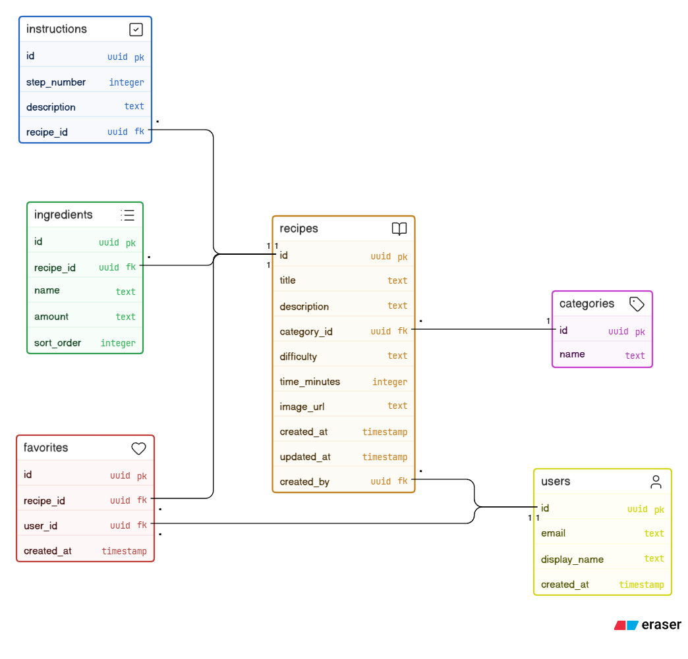

# Dessertboken

## Projektbeskrivning

**Dessertboken** är ett React-projekt som utvecklas av **Grupp 3**. Appen är en receptbok med fokus på efterrätter där användare kan skapa och dela egna recept.

Målet är att bygga en enkel och tydlig webbapp där:

- alla besökare kan titta på recept utan att vara inloggade
- inloggade användare kan lägga till egna recept
- inloggade användare kan favoritmarkera recept
- användare kan ta bort sina egna recept

## Sidor

- **Startsida** (`HomePage`)
- **Receptlista** (`RecipesPage`)
- **Receptdetaljer** (`RecipeDetailsPage`)
- **Favoriter** (`FavoritesPage`)
- **Lägg till recept** (`AddRecipePage`)
- **Redigera recept** (`EditRecipePage`)
- **404-sida** (`NotFoundPage`)

## Komponenter (byggda)

### Layout

- `Layout`
- `Header`
- `Navbar`
- `Footer`

### Recept

- `RecipeList`
- `RecipeCard`
- `FavoriteButton`
- `EditButton`
- `DeleteButton`

### Form/UI

- `AddRecipeForm`
- `SearchBar`
- `Tags`

### Auth

- `AuthModal`
- `ProtectedRoute`

## Struktur och arkitektur

- `AppRoutes` och `routes.jsx` hanterar routing med `react-router-dom`
- `AuthContext` hanterar autentiseringstillstånd
- custom hooks: `useAuth`, `useFavorite`, `useRandomRecipes`
- service-lager: `favoritesService`, `deleteService`
- `supabaseClient` för koppling mot Supabase
- CSS Modules för komponent- och sidspecifik styling

## Wireframe / Mockup

[Öppna projektets wireframe i Stitch](https://stitch.withgoogle.com/projects/444867321747387746)

## ER-Diagram



## Installation

Projektet körs lokalt med Node.js och npm.

### Kom igång

```bash
npm install
npm run dev
```

Därefter öppnar du den lokala adress som visas i terminalen, vanligtvis något i stil med:

```text
http://localhost:5173
```

### Övriga kommandon

```bash
npm run build
npm run preview
```

## Tech Stack

### Frontend

- `React 18`
- `Vite 5`
- `JavaScript (ES Modules)`
- `React Router DOM 6`
- `CSS Modules`

### Backend / Data

- `Supabase`
- `@supabase/supabase-js`

### Verktyg och arbetsflöde

- `Node.js`
- `npm`
- `Git`
- `GitHub`

## Gruppmedlemmar och ansvar

- **Nahid Baninamrah**: `AddRecipePage`, `EditRecipePage`, `AddRecipeForm`, `SearchBar`, `Tags`
- **Sandra Granholm Englund**: `RecipeDetailsPage`, `DeleteButton`, `EditButton`, `Navbar`, `FavoriteButton`
- **Hanna Geifalk**: `RecipesPage`, `FavoritesPage`, `RecipeList`, `RecipeCard`
- **Hampus Andersson**: `HomePage`, `Header`, `Footer`, routing (`AppRoutes`), auth-flöde (`AuthModal`, `ProtectedRoute`, `AuthContext`), Supabase-integration och projektstruktur
